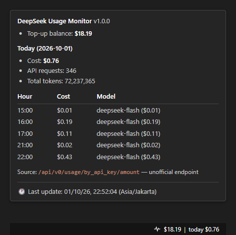

# DeepSeek Usage Monitor

A VS Code extension that shows your DeepSeek balance and today's usage in the status bar — no browser tab required.

```
$(pulse) $18.28 | today $0.61
```

Hover for a full breakdown, click for quick actions.

## Preview



The status bar item on the right shows the balance and today's cost. Hovering it opens
the tooltip: today's totals plus an hourly table naming the model used in each hour.

<sub>This preview is rendered from [`docs/preview.html`](docs/preview.html), which
reproduces the real strings and layout.</sub>

## Features

- **Status bar item** on the right, high priority, showing your topped-up balance and today's cost.
- **Rich tooltip**: top-up balance, today's cost / API requests / total tokens, and an hourly table with **the model used in each hour** and its cost contribution.
- **Click for actions**: refresh, set API key, set usage token, set the Cloudflare cookie, open the Usage page, open settings, run diagnostics.
- **Low balance warning**: the item turns to the warning background colour and a notification appears once per session when the balance drops below a configurable threshold (default `$5`).
- **Graceful failure**: an expired credential shows `$(warning) DeepSeek: sign in again`; being offline keeps showing the last cached reading marked `(offline)`. The balance keeps working even when the unofficial usage endpoint breaks.
- **Focus-aware polling**: pauses after 10 minutes without window focus and refreshes immediately when focus returns.
- **Instant start**: the last snapshot is cached, so the status bar is populated the moment VS Code opens.

## Requirements

- VS Code 1.85 or newer (Node 18+ runtime, no extra HTTP dependency).
- A DeepSeek **API key** (`sk-...`) from <https://platform.deepseek.com/api_keys> for the balance.
- Optionally, a DeepSeek **platform session token** for the usage figures.

## Getting started

### 1. Install

Build and install from the repository:

```bash
npm install
npm run compile
npm run package
code --install-extension deepseek-usage-monitor-1.0.0.vsix
```

Or press <kbd>F5</kbd> inside VS Code to launch an Extension Development Host.

### 2. Set the API key

Click the status bar item → **Set API key** → paste your `sk-...` key.

It is written to `context.secrets` (the OS keychain), never to `settings.json` or the repository.

### 3. Set the usage token (optional)

The detailed usage figures (cost, requests, tokens, per-hour models) come from private platform endpoints that accept a **browser session token**, not the API key. Without it, everything still works and the usage line simply reads `usage: unavailable`.

To obtain the token:

1. Sign in at <https://platform.deepseek.com/usage>.
2. Open DevTools (<kbd>F12</kbd>) → **Network** tab → filter **Fetch/XHR**.
3. Reload the page.
4. Click a request to `api/v0/usage/...` — for example `amount?start=...&end=...&tz=...`.
5. In **Headers → Request Headers**, copy the value of `authorization` (it looks like `Bearer eyJ...`).
6. In VS Code: click the status bar item → **Set usage token** → paste it.

If the tooltip reports a block or a 403, copy the entire `Cookie` request header instead and use **Set cf_clearance cookie**.

> The session token expires periodically. When it does, the status bar shows `usage: token expired` and the balance keeps updating — just repeat these steps.

> ⚠️ Treat this token like a password: it grants full access to your account. Never paste it into an issue, a chat or a screenshot. If it leaks, sign out and back in on the platform to invalidate it.

## Settings

| Setting | Default | Description |
| --- | --- | --- |
| `deepseekUsage.refreshIntervalSeconds` | `60` | Polling interval in seconds. Minimum 30. |
| `deepseekUsage.lowBalanceThreshold` | `5` | USD threshold for the warning colour and notification. |
| `deepseekUsage.position` | `right` | `left` or `right` side of the status bar. |
| `deepseekUsage.textFormat` | `compact` | `compact` or `full` (adds request and token counts). |
| `deepseekUsage.timezone` | `Asia/Jakarta` | IANA timezone used for the day window, hourly table and timestamps. |

Match `deepseekUsage.timezone` to the timezone selected on the DeepSeek platform, otherwise the day boundary will not line up.

## Commands

| Command | Description |
| --- | --- |
| `DeepSeek: Refresh now` | Fetch immediately, bypassing the focus pause. |
| `DeepSeek: Set API key` | Store the `sk-...` key used for the balance. |
| `DeepSeek: Set usage token` | Store the platform session token used for usage. |
| `DeepSeek: Set cf_clearance cookie` | Store an optional cookie if the platform blocks requests. |
| `DeepSeek: Diagnostics (open log)` | Run a one-shot check and print the result to the output channel. |
| `DeepSeek: Open the Usage page in a browser` | Open <https://platform.deepseek.com/usage>. |

## Status bar states

| State | Appearance |
| --- | --- |
| No API key | `$(key) DeepSeek: set API key` |
| Normal | `$(pulse) $18.28 | today $0.61` |
| Balance below threshold | Same text, warning background colour |
| Credential rejected (401/403) | `$(warning) DeepSeek: sign in again` |
| Offline | Last cached reading plus `(offline)` |
| Usage token expired | Balance shown, `usage: token expired` fragment |

## Data sources

### Balance — official API

```
GET https://api.deepseek.com/user/balance
Authorization: Bearer sk-...
```

Returns `is_available` and a `balance_infos` array with per-currency `total_balance`, `granted_balance` and `topped_up_balance` (all as strings).

### Usage — internal, unofficial endpoints

```
GET https://platform.deepseek.com/api/v0/usage/by_api_key/amount?start=<unix>&end=<unix>&tz=<offset>
GET https://platform.deepseek.com/api/v0/usage/by_api_key/cost?start=<unix>&end=<unix>&tz=<offset>
Authorization: Bearer <platform session token>
```

- `start` / `end` are unix **seconds**. `tz` is the negated timezone offset in seconds, i.e. `new Date().getTimezoneOffset() * 60` — `-25200` for GMT+7. This reproduces exactly what the `/usage` page itself sends.
- The response is `data.biz_data.series[].buckets[]` (for `cost`, `series` lives under `data.biz_data.data[]`, grouped by `currency`) with `bucket = 3600`. Because one bucket is one hour, the hourly breakdown and the per-model split come from the same request.
- The API key cannot authenticate these endpoints. They are **unofficial and may change or disappear without notice** — that is why the parser treats an unknown shape as "unavailable" rather than failing.

## Security and privacy

- The API key, the session token and the cookie are stored **only** in `context.secrets` (the OS keychain).
- They are never written to `settings.json`, the global-state cache, log output, error messages or the repository.
- Requests are restricted to `api.deepseek.com` and `platform.deepseek.com` by a host allow-list.
- No telemetry, no analytics, no third-party services.
- Only balance and usage counts are cached, and only so the status bar can render instantly at startup.

## Architecture

| File | Responsibility |
| --- | --- |
| `src/extension.ts` | Activation, polling, focus/settings handling, commands. |
| `src/deepseekClient.ts` | HTTP with timeout, retry and host allow-list; balance and usage requests; error mapping. |
| `src/usageParser.ts` | Response parsing, cache normalisation, timezone helpers, safe response-shape reporting. |
| `src/statusBar.ts` | Status bar text, tooltip and warning rendering. |
| `src/log.ts` | Output channel used for diagnostics. |
| `src/selfcheck.ts` | Runtime-free assertions over the pure modules. |

Deliberate design decisions:

- **No bundler and no runtime dependencies.** The extension ships compiled `tsc` output and uses `node:https`.
- **Defensive parsing.** An unrecognised response yields `null`, so the balance feature never breaks because of a change in an unofficial endpoint.
- **Cache schema versioning.** The cache key carries a schema version and every cached payload is normalised on read, so a stale shape cannot break activation.
- **Rendering never throws.** Tooltip failures are caught and logged instead of propagating into `activate()`.

## Development

```bash
npm install
npm run compile      # tsc
npm run selfcheck    # compile + runtime-free assertions
npm run watch        # tsc in watch mode
npm run package      # build the .vsix
```

Press <kbd>F5</kbd> to launch an Extension Development Host. To debug a live issue, run **DeepSeek: Diagnostics (open log)** and read the output channel; it reports which endpoint answered, the HTTP error code, and the *field names* of an unrecognised response — never credentials or response values.

## Limitations

- The usage numbers come from unofficial endpoints and can break at any time.
- Platform data lags by up to 5 minutes, so a 60-second poll interval is already generous.
- Only **today** is fetched. The hourly table covers the current day only.
- The token-usage view is a status bar tooltip, not a webview, so there is no chart.
- DST transitions inside a 24-hour window are handled by taking the offset at the current instant; timezones without DST (such as `Asia/Jakarta`) are unaffected.

## Disclaimer

This project is not affiliated with, endorsed by, or supported by DeepSeek. It uses an undocumented internal endpoint of the DeepSeek platform, which may change or be removed at any time. Do not rely on it for billing-critical decisions.

## License

[MIT](LICENSE)
